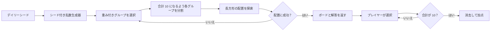

# Fruit Box オープンソース版

[English](README.md) | [日本語](README.ja.md) | [한국어](README.ko.md)

[日本語版をオンラインでプレイ](https://fruitboxgame.com/ja)

Fruit Box のフレームワークを使用しないオープンソース版です。プレーンな HTML、CSS、JavaScript で構成され、オンライン版と同じボード生成処理とゲームルールを採用しています。


## 実行方法

`index.html` を直接開くか、このディレクトリで任意の静的サーバーを起動します。

```bash
python -m http.server 8080
```

続いて <http://localhost:8080> を開きます。

ゲーム自体にビルド手順や実行時依存関係はありません。Google Fonts へのリクエストは任意で、オフライン時はローカルフォントにフォールバックします。

## エンジンのテスト

決定論的なエンジンには、依存関係のない Node.js テストが用意されています。

```bash
node tests/engine.test.mjs
```

50 個のシード、出力の再現性、解答手順の妥当性、ボードの完全消去、選択境界の厳密な判定を検証します。

## ファイル

| ファイル | 用途 |
| --- | --- |
| `index.html` | 最小構成の英語ゲームページ |
| `styles.css` | ボード、操作部、レスポンシブレイアウト、フェードインモーション |
| `app.js` | DOM 描画、ポインター／キーボード入力、タイマー、ヒント、サウンド、ローカル最高得点 |
| `engine.js` | `window.FruitBoxEngine` として公開される純粋なブラウザー用ゲームエンジン |
| `tests/engine.test.mjs` | 依存関係のないエンジン検証 |
| `docs/PLAY_GUIDE.ja.md` | 図解付きの日本語プレイガイド |
| `docs/ALGORITHM.ja.md` | 生成、選択、ヒントのアルゴリズム解説 |
| `assets/` | ゲーム画面、アーキテクチャ図、解答可能ボードの生成フロー画像 |

## ルール

- ボードは常に `17 × 10`（リンゴ 170 個）です。
- 1 ラウンドは 120 秒です。
- 長方形の内側に**中心点**が厳密に含まれる有効なリンゴが選択されます。
- 選択した値の合計がちょうど `10` の場合に消去できます。
- 得点は消去したリンゴの数です。
- デイリーボードは決定論的に生成され、UTC 05:00 に切り替わります。
- 同じ日にリセットすると、進行状況が消去され、同じボードに戻ります。

## プレイガイド

操作方法、選択ルール、ヒント、時間制御については、[図解付きプレイガイド](docs/PLAY_GUIDE.ja.md)をご覧ください。

## 解答可能性の仕組み

ジェネレーターは、表示するボードを作る前に完全な解答を生成します。




データモデル、グループの重み付き分布、累積和による配置、時間制御、計算量については [docs/ALGORITHM.ja.md](docs/ALGORITHM.ja.md) をご覧ください。

## オンライン版との互換性

`engine.js` は、オンライン版の `lib/fruit-box-engine.ts` にある純粋関数をブラウザーのグローバル形式に移植したものです。次の仕様を共通化しています。

1. LCG によるシード付き乱数生成と UTC 05:00 基準のデイリーシード。
2. 2～10 セルの重み付きグループ。
3. 合計が 10 になるランダムな整数分割。
4. 2 次元累積和による長方形候補と検証済み解答手順。
5. 中心点に対する厳密な選択判定、消去、ヒントのフォールバック、時間表示。

静的版の `app.js` は React の状態管理だけを置き換えます。ゲームはクライアント側で決定論的に動作するため、この版はサーバー検証型の競技ではなく、学習、フォーク、静的ホスティングを目的としています。

## ライセンス

[MIT](LICENSE)
