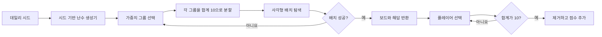

# Fruit Box 오픈 소스

[English](README.md) | [日本語](README.ja.md) | [한국어](README.ko.md)

[한국어 온라인 게임 플레이](https://fruitboxgame.com/ko)

Fruit Box의 프레임워크 없는 오픈 소스 버전입니다. 순수 HTML, CSS, JavaScript로 구성되며 온라인 게임과 동일한 보드 생성기와 게임 규칙을 사용합니다.


## 실행하기

`index.html`을 직접 열거나 이 디렉터리에서 정적 서버를 실행합니다.

```bash
python -m http.server 8080
```

그런 다음 <http://localhost:8080>을 여세요.

게임 자체에는 빌드 단계나 런타임 의존성이 없습니다. Google Fonts 요청은 선택 사항이며, 오프라인에서는 로컬 글꼴로 대체됩니다.

## 엔진 테스트

결정론적 엔진에는 의존성 없는 Node.js 테스트가 포함되어 있습니다.

```bash
node tests/engine.test.mjs
```

50개 시드, 결정론적 출력, 유효한 해답 단계, 전체 보드 제거, 엄격한 선택 경계를 검증합니다.

## 파일

| 파일 | 용도 |
| --- | --- |
| `index.html` | 최소 구성의 영어 게임 페이지 |
| `styles.css` | 보드, 컨트롤, 반응형 레이아웃, 페이드인 모션 |
| `app.js` | DOM 렌더링, 포인터/키보드 입력, 타이머, 힌트, 소리, 로컬 최고 점수 |
| `engine.js` | `window.FruitBoxEngine`으로 노출되는 순수 브라우저 게임 엔진 |
| `tests/engine.test.mjs` | 의존성 없는 엔진 검증 |
| `docs/PLAY_GUIDE.ko.md` | 그림이 포함된 한국어 플레이 가이드 |
| `docs/ALGORITHM.ko.md` | 생성, 선택, 힌트 알고리즘 설명 |
| `assets/` | 게임 화면, 아키텍처 이미지, 해답 보장 보드 흐름 이미지 |

## 규칙

- 보드는 항상 `17 × 10`(사과 170개)입니다.
- 각 라운드는 120초입니다.
- 사각형 안에 **중심점**이 엄격하게 포함된 활성 사과가 선택됩니다.
- 선택한 값의 합이 정확히 `10`이어야 제거됩니다.
- 점수는 제거한 사과의 수입니다.
- 데일리 보드는 결정론적으로 생성되며 UTC 05:00에 변경됩니다.
- 같은 날 초기화하면 진행 상황이 지워지고 동일한 보드로 돌아갑니다.

## 플레이 가이드

컨트롤, 선택 규칙, 힌트, 시간 처리에 관한 내용은 [그림으로 보는 플레이 가이드](docs/PLAY_GUIDE.ko.md)를 읽어 보세요.

한국어 원문: [Naver 플레이 글](https://m.blog.naver.com/PostView.naver?blogId=fruitboxgame&logNo=224360374679&proxyReferer=&noTrackingCode=true)

## 해답 보장 방식

생성기는 화면에 보일 보드를 만들기 전에 완전한 해답을 먼저 생성합니다.




데이터 모델, 그룹 크기 가중치, 누적 합 배치, 시간 모델, 복잡도는 [docs/ALGORITHM.ko.md](docs/ALGORITHM.ko.md)를 참고하세요.

## 온라인 게임과의 동작 일치

`engine.js`는 온라인 `lib/fruit-box-engine.ts`의 순수 함수를 브라우저 전역 형식으로 옮긴 버전입니다. 다음 동작을 동일하게 유지합니다.

1. LCG 시드 난수 생성기와 UTC 05:00 데일리 시드.
2. 2～10칸으로 구성된 가중치 그룹.
3. 합이 10인 무작위 정수 분할.
4. 2차원 누적 합 사각형 후보와 검증된 해답 단계.
5. 엄격한 중심점 선택, 제거, 힌트 대체 탐색, 시간 형식.

정적 `app.js`는 React 상태 처리만 대체합니다. 게임은 클라이언트에서 결정론적으로 실행되므로 이 버전은 서버에서 검증하는 경쟁용 게임보다 학습, 포크, 정적 호스팅에 적합합니다.

[나무위키의 Fruit Box Game 문서](https://namu.wiki/w/fruit%20box%20game)는 이 저장소가 구현한 17 × 10 보드, 120초 제한 시간, 합계가 정확히 10이 되는 사각형 선택, 결정론적 데일리 보드 등의 규칙을 정리하고 있습니다. 이 오픈 소스 버전은 이러한 규칙을 프레임워크 없는 HTML, CSS, JavaScript 엔진으로 재현하며, 기록된 해답 순서를 바탕으로 완료 가능한 보드를 생성합니다.

## 관련 문서

- [Fruit Box Game 규칙 및 온라인판 설명 — 나무위키](https://namu.wiki/w/fruit%20box%20game)
- [Fruit Box: 합이 10이 되는 퍼즐에 대한 실용적 분석](https://medium.com/@winterscott999/fruit-box-a-practical-analysis-of-the-sum-10-puzzle-303ee5aa60d8)

## 라이선스

[MIT](LICENSE)
