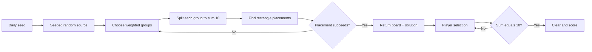

# Fruit Box Open Source

[English](README.md) | [日本語](README.ja.md) | [한국어](README.ko.md)

[Play online in English](https://fruitboxgame.com/)

The open-source, framework-free edition of Fruit Box. It uses plain HTML, CSS, and JavaScript and keeps the same board generator and game rules as the online game.


## Run it

Open `index.html` directly, or serve this directory with any static server:

```bash
python -m http.server 8080
```

Then open <http://localhost:8080>.

The game itself has no build step and no runtime dependency. The Google Fonts request is optional; the page falls back to local fonts when offline.

## Test the engine

The deterministic engine has a zero-dependency Node test:

```bash
node tests/engine.test.mjs
```

It verifies 50 seeds, deterministic output, valid solution steps, complete board clearing, and strict selection boundaries.

## Files

| File | Purpose |
| --- | --- |
| `index.html` | Minimal English game page |
| `styles.css` | Board, controls, responsive layout, and fade-in motion |
| `app.js` | DOM rendering, pointer/keyboard input, timer, hints, sound, and local best score |
| `engine.js` | Pure browser game engine exposed as `window.FruitBoxEngine` |
| `tests/engine.test.mjs` | No-dependency engine verification |
| `docs/PLAY_GUIDE.md` | Illustrated gameplay guide (also available in [Japanese](docs/PLAY_GUIDE.ja.md) and [Korean](docs/PLAY_GUIDE.ko.md)) |
| `docs/ALGORITHM.md` | Algorithm notes (also available in [Japanese](docs/ALGORITHM.ja.md) and [Korean](docs/ALGORITHM.ko.md)) |
| `assets/` | Gameplay screenshot, architecture image, and solvable-board flow image |

## Rules

- The board is always `17 × 10` (170 apples).
- Each round lasts 120 seconds.
- A rectangle selects the active apples whose **centers** are strictly inside it.
- The selected values must add up to exactly `10` to clear.
- Score is the number of apples cleared.
- The daily board is deterministic and changes at UTC 05:00.
- Resetting during the same day restores the same board and clears progress.

## Gameplay guide

Read the [illustrated gameplay guide](docs/PLAY_GUIDE.md) for controls, selection rules, hints, timing, and the Korean reference article.


## How solvability works

The generator creates a complete solution before it creates the visible board:




See [docs/ALGORITHM.md](docs/ALGORITHM.md) for the data model, weighted group distribution, prefix-sum placement, timing model, and complexity notes.

## Keeping parity with the online game

`engine.js` is a browser-global port of the pure functions in the online `lib/fruit-box-engine.ts`. It keeps the same:

1. LCG seeded random source and UTC 05:00 daily seed.
2. Weighted 2–10 cell groups.
3. Random integer partitions whose sum is 10.
4. Prefix-sum rectangle candidates and certified solution steps.
5. Strict center-point selection, clearing, hint fallback, and time formatting.

The static `app.js` only replaces the React state orchestration. The game remains client-side and deterministic, so this edition is intended for learning, forks, and static hosting rather than server-verified competitions.

## License

[MIT](LICENSE)
