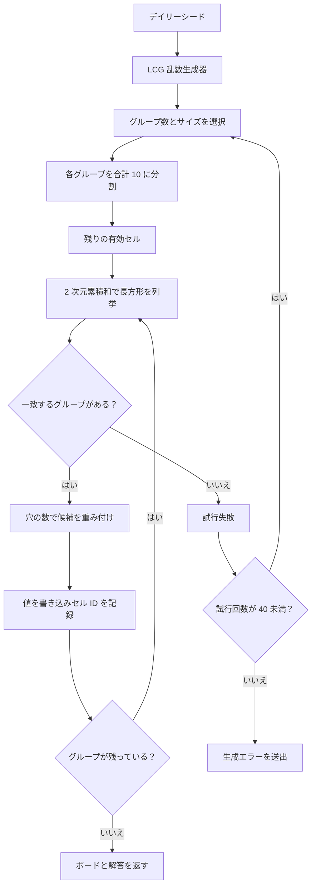

# Fruit Box のアルゴリズム

[English](ALGORITHM.md) | [日本語](ALGORITHM.ja.md) | [한국어](ALGORITHM.ko.md)

[日本語版をオンラインでプレイ](https://fruitboxgame.com/ja)

## 1. 生成の目的

`1..9` の値を無作為に並べるだけでは、クリア可能なボードになるとは限りません。Fruit Box は、まず有効な長方形による完全な解答手順を生成し、そのグループをボードに配置します。記録された各手順は順番に消去でき、合計が必ず `10` になります。


## 2. データモデル

```js
{
  board: [{ id, row, column, value, active }],
  solution: [{ selection: { top, right, bottom, left }, cellIds }]
}
```

`solution` はジェネレーターが保持する検証用の手順です。次の検証済み手順がまだ有効なら、ヒントに利用されます。プレイヤーが別の順序でグループを消して手順が崩れた場合、エンジンは現在のボードを走査して有効な長方形を探します。

## 3. 生成フロー



### グループサイズ

グループは 2～10 セルで構成されます。小さいグループほど意図的に出現しやすくなっています。

| サイズ | 2 | 3 | 4 | 5 | 6 | 7 | 8 | 9 | 10 |
| --- | ---: | ---: | ---: | ---: | ---: | ---: | ---: | ---: | ---: |
| 重み | 34 | 25 | 17 | 10 | 6 | 4 | 2 | 1 | 1 |

動的計画法のテーブル `ways[group][cells]` は、重み付きの完了方法を数えます。これにより、想定した分布を保ちながら 170 セルを必ず使い切るグループ数を選択できます。

### 10 への分割

サイズ `n` のグループでは、`1..9` から `n - 1` 個の切れ目を選び、並べ替えて、境界 `0` と `10` を加え、隣接する値の差を取ります。切れ目 `[2, 5]` は `[2, 3, 5]` になります。

## 4. 選択ルール

ポインター座標は `17 × 10` の論理グリッドに変換され、長方形に正規化されます。エンジンは有効な各リンゴの中心点を確認します。

```js
const centerX = apple.column + 0.5;
const centerY = apple.row + 0.5;
const inside = centerY > selection.top && centerY < selection.bottom
  && centerX > selection.left && centerX < selection.right;
```

厳密な不等号により、オンラインゲームと同じ境界動作を保ちます。`clearSelection` は調べた合計がちょうど 10 の場合だけ新しいボードを返し、それ以外では元のボードと `cleared: 0` を返します。

## 5. 時間とデイリーシード

タイマーは絶対時刻の `deadline` を保持し、100 ms ごとに `deadline - Date.now()` を計算します。これにより、タブがバックグラウンドになってもインターバルのずれを防ぎます。デイリーシードの計算は次と同等です。

```js
const shifted = new Date(now.getTime() - 5 * 60 * 60 * 1000);
return Date.parse(shifted.toISOString().slice(0, 10)) >>> 0;
```

同じ UTC の日付区間では、すべてのプレイヤーに同じボードが配られます。クライアントでの決定論的生成は、1 人用のオープンソースゲームには適していますが、サーバー検証型の競技には適していません。

## 6. 計算量

- 生成処理が列挙する長方形は最大 `O(rows² × columns²)` です。固定された `17 × 10` のボードはブラウザーで十分に扱える大きさです。
- 選択範囲の検査は最大 170 個のリンゴを調べる `O(board)` です。
- `findAvailableMove` は同じ長方形列挙を使い、実行中の合計が 10 を超えた分岐を打ち切ります。

## 7. 検証する不変条件

各シードについて次を検証します。

- `board.length === 170` で、すべての値が `1..9` の範囲にあること。
- 解答手順が各セル ID をちょうど 1 回ずつ含むこと。
- 解答順に `clearSelection` を適用すると 170 個すべてのリンゴが消えること。
- 同じシードから、バイト単位で同一のボードと解答データが生成されること。
