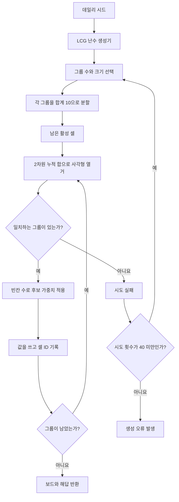

# Fruit Box 알고리즘

[English](ALGORITHM.md) | [日本語](ALGORITHM.ja.md) | [한국어](ALGORITHM.ko.md)

[한국어 온라인 게임 플레이](https://fruitboxgame.com/ko)

## 1. 생성 목표

`1..9` 값을 무작위로 배치하는 것만으로는 완료 가능한 보드를 보장할 수 없습니다. Fruit Box는 먼저 유효한 사각형으로 이루어진 전체 해답을 생성한 다음 그 그룹을 보드에 배치합니다. 기록된 각 단계는 순서대로 제거할 수 있고 합계가 정확히 `10`입니다.


## 2. 데이터 모델

```js
{
  board: [{ id, row, column, value, active }],
  solution: [{ selection: { top, right, bottom, left }, cellIds }]
}
```

`solution`은 생성기가 보관하는 검증 경로입니다. 다음 검증된 단계가 여전히 유효하면 힌트에서 사용합니다. 플레이어가 다른 순서로 그룹을 제거해 경로가 깨지면 엔진은 현재 보드를 실시간으로 탐색해 유효한 사각형을 찾습니다.

## 3. 생성 흐름



### 그룹 크기

그룹은 2～10칸으로 구성됩니다. 작은 그룹이 의도적으로 더 자주 등장합니다.

| 크기 | 2 | 3 | 4 | 5 | 6 | 7 | 8 | 9 | 10 |
| --- | ---: | ---: | ---: | ---: | ---: | ---: | ---: | ---: | ---: |
| 가중치 | 34 | 25 | 17 | 10 | 6 | 4 | 2 | 1 | 1 |

동적 계획법 테이블 `ways[group][cells]`는 가중치가 적용된 완료 방법의 수를 셉니다. 이를 통해 의도한 분포를 유지하면서 170칸을 모두 사용하는 그룹 수를 선택할 수 있습니다.

### 10으로 분할하기

크기가 `n`인 그룹은 `1..9`에서 `n - 1`개의 분할점을 선택해 정렬하고, 경계 `0`과 `10`을 추가한 뒤 인접한 값의 차이를 구합니다. 분할점 `[2, 5]`는 `[2, 3, 5]`가 됩니다.

## 4. 선택 규칙

포인터 좌표는 `17 × 10` 논리 격자에 매핑되고 사각형으로 정규화됩니다. 엔진은 각 활성 사과의 중심점을 확인합니다.

```js
const centerX = apple.column + 0.5;
const centerY = apple.row + 0.5;
const inside = centerY > selection.top && centerY < selection.bottom
  && centerX > selection.left && centerX < selection.right;
```

엄격한 부등식으로 온라인 게임의 경계 동작을 유지합니다. `clearSelection`은 검사한 합계가 정확히 10일 때만 새 보드를 반환하며, 그렇지 않으면 원래 보드와 `cleared: 0`을 반환합니다.

## 5. 시간과 데일리 시드

타이머는 절대 시각인 `deadline`을 저장하고 100ms마다 `deadline - Date.now()`를 계산합니다. 탭이 백그라운드로 이동해도 인터벌 오차가 쌓이지 않습니다. 데일리 시드 계산은 다음과 같습니다.

```js
const shifted = new Date(now.getTime() - 5 * 60 * 60 * 1000);
return Date.parse(shifted.toISOString().slice(0, 10)) >>> 0;
```

따라서 같은 UTC 날짜 구간의 모든 플레이어는 같은 보드를 받습니다. 클라이언트의 결정론적 생성은 1인용 오픈 소스 게임에는 적합하지만 서버 검증 경쟁에는 적합하지 않습니다.

## 6. 복잡도

- 생성 과정은 최대 `O(rows² × columns²)`개의 사각형을 열거합니다. 고정된 `17 × 10` 보드는 브라우저에서 처리하기에 충분히 작습니다.
- 선택 검사는 최대 170개 사과를 확인하는 `O(board)`입니다.
- `findAvailableMove`는 같은 사각형 열거 방식을 사용하며 누적 합이 10을 넘으면 해당 분기를 중단합니다.

## 7. 검증할 불변 조건

각 시드에 대해 다음을 검증합니다.

- `board.length === 170`이고 모든 값이 `1..9` 범위에 있어야 합니다.
- 해답 단계가 각 셀 ID를 정확히 한 번 포함해야 합니다.
- 해답 순서대로 `clearSelection`을 적용하면 사과 170개가 모두 제거되어야 합니다.
- 같은 시드는 바이트 단위로 동일한 보드와 해답 데이터를 생성해야 합니다.
