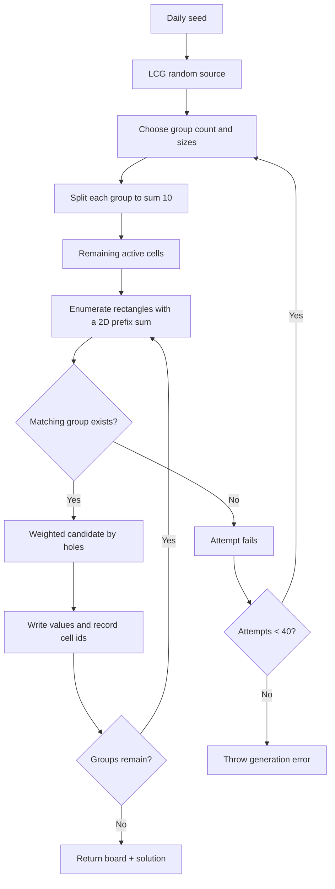

# Fruit Box Algorithm

[English](ALGORITHM.md) | [日本語](ALGORITHM.ja.md) | [한국어](ALGORITHM.ko.md)

[Play online in English](https://fruitboxgame.com/)

## 1. Generation goal

Random `1..9` values do not guarantee a finishable board. Fruit Box generates a complete sequence of legal rectangles first, then lays those groups into the board. Every recorded step can be cleared in order and totals exactly `10`.


## 2. Data model

```js
{
  board: [{ id, row, column, value, active }],
  solution: [{ selection: { top, right, bottom, left }, cellIds }]
}
```

`solution` is a verification trail kept by the generator. Hints use the next certified step when it is still valid. If the player clears groups in another order and breaks that trail, the engine falls back to a live rectangle scan.

## 3. Generation flow



### Group sizes

Groups contain 2–10 cells. Smaller groups are intentionally more common:

| Size | 2 | 3 | 4 | 5 | 6 | 7 | 8 | 9 | 10 |
| --- | ---: | ---: | ---: | ---: | ---: | ---: | ---: | ---: | ---: |
| Weight | 34 | 25 | 17 | 10 | 6 | 4 | 2 | 1 | 1 |

A dynamic-programming table `ways[group][cells]` counts weighted completions. This lets the generator choose a group count that always consumes all 170 cells while preserving the intended distribution.

### Splitting to ten

For a group of size `n`, the engine chooses `n - 1` cut points from `1..9`, sorts them, adds boundaries `0` and `10`, and takes adjacent differences. Cut points `[2, 5]` become `[2, 3, 5]`.

## 4. Selection rules

Pointer coordinates are mapped into the 17 × 10 logical grid and normalized into a rectangle. For each active apple, the engine checks its center point:

```js
const centerX = apple.column + 0.5;
const centerY = apple.row + 0.5;
const inside = centerY > selection.top && centerY < selection.bottom
  && centerX > selection.left && centerX < selection.right;
```

The strict inequalities preserve the online game's edge behavior. `clearSelection` returns a new board only when the inspected sum is exactly 10; otherwise it returns the original board and `cleared: 0`.

## 5. Time and daily seed

The timer stores an absolute `deadline` and derives `deadline - Date.now()` every 100ms. This avoids interval drift when a tab is backgrounded. Daily seed calculation is equivalent to:

```js
const shifted = new Date(now.getTime() - 5 * 60 * 60 * 1000);
return Date.parse(shifted.toISOString().slice(0, 10)) >>> 0;
```

All players therefore receive the same board during the same UTC day window. Deterministic client generation is suitable for a single-player open-source game, not for a server-verified competition.

## 6. Complexity

- Generation enumerates at most `O(rows² × columns²)` rectangles; the fixed 17 × 10 board is small enough for the browser.
- Selection inspection is `O(board)`, at most 170 apples.
- `findAvailableMove` uses the same rectangle enumeration and stops a branch when its running sum exceeds 10.

## 7. Invariants to verify

For every seed:

- `board.length === 170` and every value is in `1..9`.
- Solution steps cover every cell id exactly once.
- Applying `clearSelection` in solution order clears all 170 apples.
- The same seed produces byte-for-byte equivalent board and solution data.
