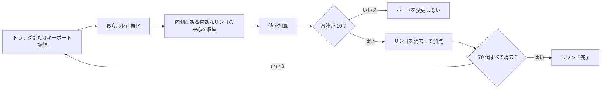

# Fruit Box プレイガイド

[English](PLAY_GUIDE.md) | [日本語](PLAY_GUIDE.ja.md) | [한국어](PLAY_GUIDE.ko.md)

[日本語版をオンラインでプレイ](https://fruitboxgame.com/ja)

Fruit Box は、長方形を選択して遊ぶテンポの速いパズルです。有効なリンゴの値の合計がちょうど **10** になるように選択し、すべてのリンゴを消去します。

## 1. ラウンドを開始する

ゲームを開き、**120 秒ラウンドを開始**を押します。各ラウンドでは、その日の決定論的なボードが使われます。ボードには `17 × 10` の配置で 170 個のリンゴがあります。

タイマーはボタンを押してから動き始めます。最高得点はブラウザーにローカル保存されます。

## 2. 長方形を選択する

### マウスまたはタッチ

ボード内で押し、反対側の角までドラッグして離します。どの方向にもドラッグでき、エンジンが 2 点を 1 つの長方形に正規化します。

### キーボード

ボードにフォーカスを合わせ、次のキーを使います。

| キー | 動作 |
| --- | --- |
| 矢印キー | 現在のセルフォーカスを移動 |
| Shift + 矢印キー | 選択範囲を拡張 |
| Enter | 選択した長方形の消去を試行 |
| Escape | 現在の選択をキャンセル |

## 3. 合計をちょうど 10 にする

長方形を選択すると、右上の小さなバッジに現在の合計が表示されます。

- 合計が **10** なら有効な手となり、赤く強調されます。
- それ以外の合計ではボードは変わらず、失敗時のフィードバックが再生されます。
- 有効なリンゴだけが合計に含まれます。消去したセルは空になりますが、固定グリッドの一部として残ります。

境界の判定は厳密です。リンゴの中心点が長方形の内側に厳密に入っている場合だけ選択されます。これにより、マウス、タッチ、キーボードの動作が一致します。

## 4. 操作ボタンを使う

| 操作 | 動作 |
| --- | --- |
| **ヒント** | 次の検証済み解答手順を 1.4 秒間強調します。元の手順が崩れている場合、現在のボードから別の有効な手を探索します。 |
| **一時停止／再開** | 絶対時刻の期限を停止、再開します。一時停止中は時間を消費しません。 |
| **新しいボード** | 現在のデイリーボードを、得点とタイマーをリセットして再開します。 |
| **淡色** | ボードの彩度を下げ、柔らかな表示にします。 |
| **サウンド** | 消去、失敗、完了時の短い効果音を切り替えます。 |

## 5. ボードを完成させる

タイマーが 0 になる前に 170 個すべてのリンゴを消去します。完了するとクリア時間が表示され、以前より高ければローカルの最高得点が更新されます。先に時間切れになった場合、現在の得点が結果画面に表示されます。

すべてのボードは記録済みの解答から生成されるため、初期状態では必ずクリアできます。解答の構築と検証方法については [ALGORITHM.ja.md](ALGORITHM.ja.md) をご覧ください。
