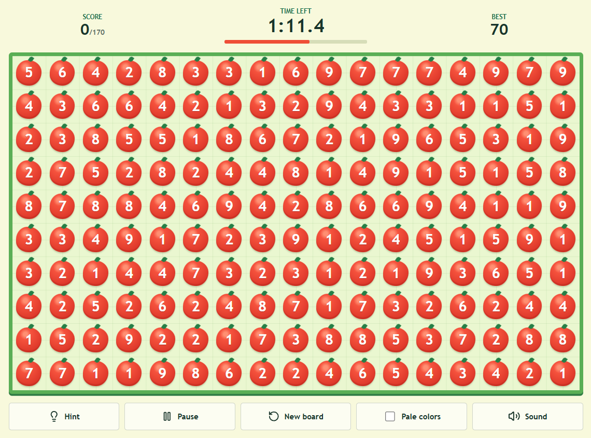
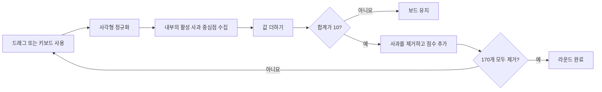
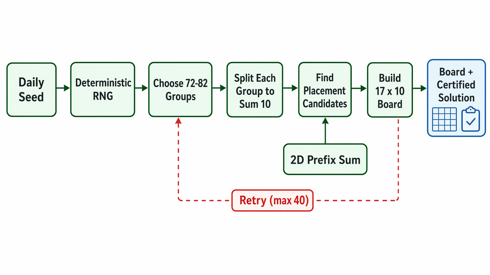

# Fruit Box 플레이 가이드

[English](PLAY_GUIDE.md) | [日本語](PLAY_GUIDE.ja.md) | [한국어](PLAY_GUIDE.ko.md)

[한국어 온라인 게임 플레이](https://fruitboxgame.com/ko)

Fruit Box는 사각형을 빠르게 선택하는 퍼즐입니다. 활성 사과의 값 합계가 정확히 **10**이 되도록 선택해 모든 사과를 제거하세요.

## 1. 라운드 시작하기

게임을 열고 **120초 라운드 시작**을 누르세요. 각 라운드는 오늘 날짜에 맞춰 결정론적으로 생성된 보드를 사용합니다. 보드에는 `17 × 10` 배열로 170개의 사과가 있습니다.

타이머는 버튼을 누른 뒤에만 시작됩니다. 최고 점수는 브라우저에 로컬로 저장됩니다.

## 2. 사각형 선택하기

### 마우스 또는 터치

보드 안에서 누른 뒤 반대쪽 모서리까지 드래그하고 놓으세요. 어느 방향으로든 드래그할 수 있으며 엔진이 두 점을 하나의 사각형으로 정규화합니다.

### 키보드

보드에 포커스를 두고 다음 키를 사용하세요.

| 키 | 동작 |
| --- | --- |
| 방향키 | 현재 셀 포커스 이동 |
| Shift + 방향키 | 선택 사각형 확장 |
| Enter | 선택한 사각형 제거 시도 |
| Escape | 현재 선택 취소 |

## 3. 정확히 10 만들기

사각형을 선택하면 오른쪽 위의 작은 배지에 현재 합계가 표시됩니다.

- 합계가 **10**이면 유효한 수로 판정되어 빨간색으로 강조됩니다.
- 다른 합계에서는 보드가 그대로 유지되고 실패 피드백이 재생됩니다.
- 활성 사과만 합계에 포함됩니다. 제거된 칸은 비어 있지만 고정된 격자의 일부로 남습니다.

경계 규칙은 엄격합니다. 사과의 중심점이 사각형 내부에 완전히 들어올 때만 선택됩니다. 따라서 마우스, 터치, 키보드의 동작이 동일합니다.

## 4. 컨트롤 사용하기

| 컨트롤 | 동작 |
| --- | --- |
| **힌트** | 다음 검증된 해답 단계를 1.4초 동안 강조합니다. 기존 단계가 깨졌다면 현재 보드에서 다른 유효한 수를 찾습니다. |
| **일시 정지 / 계속** | 절대 마감 시각을 멈추고 다시 시작합니다. 일시 정지 중에는 시간이 줄지 않습니다. |
| **새 보드** | 현재 데일리 보드를 점수와 타이머가 초기화된 상태로 다시 시작합니다. |
| **연한 색상** | 보드 채도를 낮춰 부드러운 화면 모드로 전환합니다. |
| **소리** | 제거, 실패, 완료 시의 짧은 효과음을 켜거나 끕니다. |

## 5. 보드 완료하기

타이머가 0이 되기 전에 사과 170개를 모두 제거하세요. 완료된 라운드는 클리어 시간을 보여 주고, 이전 기록보다 높으면 로컬 최고 점수를 갱신합니다. 시간이 먼저 끝나면 현재 점수가 결과 화면에 표시됩니다.

모든 보드는 기록된 해답에서 생성되므로 새 보드는 반드시 완료할 수 있습니다. 해답을 구성하고 검증하는 방법은 [ALGORITHM.ko.md](ALGORITHM.ko.md)를 참고하세요.

## 한국어 원문

플레이 방법과 원본 참고 자료는 다음 Naver 글에서 확인할 수 있습니다.

[Fruit Box 한국어 플레이 글](https://blog.naver.com/fruitboxgame/224360374679)

