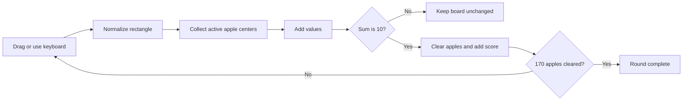

# Fruit Box Gameplay Guide

[English](PLAY_GUIDE.md) | [日本語](PLAY_GUIDE.ja.md) | [한국어](PLAY_GUIDE.ko.md)

[Play online in English](https://fruitboxgame.com/)

Fruit Box is a fast rectangle-selection puzzle. Clear every apple by selecting active apples whose values add up to exactly **10**.

## 1. Start a round

Open the game and press **Start 120-second round**. Every round uses the deterministic board for the current day. The board contains 170 apples arranged in a 17 × 10 grid.

The timer starts only after the button is pressed. Your best score is saved locally in the browser.

## 2. Select a rectangle

### Mouse or touch

Press inside the board, drag to the opposite corner, and release. The selection can be dragged in any direction; the engine normalizes the two points into one rectangle.

### Keyboard

Focus the board and use:

| Key | Action |
| --- | --- |
| Arrow keys | Move the current cell focus |
| Shift + Arrow keys | Extend the selection rectangle |
| Enter | Try to clear the selected rectangle |
| Escape | Cancel the current selection |

## 3. Make exactly ten

When a rectangle is selected, the small badge in its top-right corner shows the current sum.

- A sum of **10** is a valid move and is highlighted in red.
- Any other sum stays on the board and plays the miss feedback.
- Only active apples count. Cleared cells become empty but remain part of the fixed grid.

The boundary rule is precise: an apple counts only when its center point is strictly inside the rectangle. This keeps mouse, touch, and keyboard behavior identical.

## 4. Use the controls

| Control | Behavior |
| --- | --- |
| **Hint** | Highlights the next certified solution step for 1.4 seconds. If the original step was disrupted, the engine searches the current board for another valid move. |
| **Pause / Resume** | Stops and resumes the absolute deadline. Pausing does not consume time. |
| **New board** | Restarts the current daily board with score and timer reset. |
| **Pale** | Reduces board saturation for a softer visual mode. |
| **Sound** | Toggles the short clear, miss, and completion tones. |

## 5. Finish the board

Clear all 170 apples before the timer reaches zero. A completed round shows your clear time and updates the local best score when it is higher than the previous one. If the timer reaches zero first, the current score is kept on the result screen.

Every board is generated from a recorded solution, so a fresh board is guaranteed to be finishable. Read [ALGORITHM.md](ALGORITHM.md) to see how the solution is constructed and verified.

